# Mask re-identification and mask detection dataset

This repository provides a code for creating a dataset of people wearing masks for re-identification by "covering" existing face images with masks using a 3D Face Reconstruction technology.
In addition, we evaluated an existing re-identification model on obtained dataset and compared the results with the one observed on the original test set.

## Dataset creation tool

The main steps of dataset creation together with time consumption:

  1. Find an appropriate open-source 3D Face Reconstruction solution, clone it and run the demo (2 hours).

     **Used solution:** [3DDFA_V2](https://github.com/cleardusk/3DDFA_V2) based on [this paper](https://arxiv.org/abs/2009.09960).

  2. Collect RGBA face-mask images and preprocess them in image editor (2 hours).
     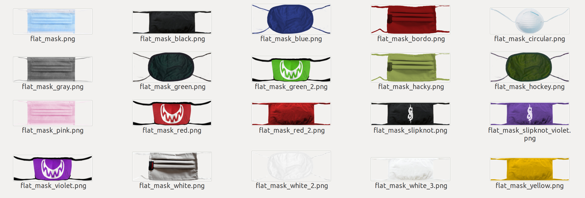

  3. Use 3DDFA_V2 and processed face-mask images to add a face mask on the input face image (36 hours).

     **High-level overview of the algorithm**

     **Input:** an image with a face, an image of a processed mask

     **Output:** original image with the face covered by the mask

     **Steps:**
      - Obtain the 3D face model and pose using 3DDFA_V2;
          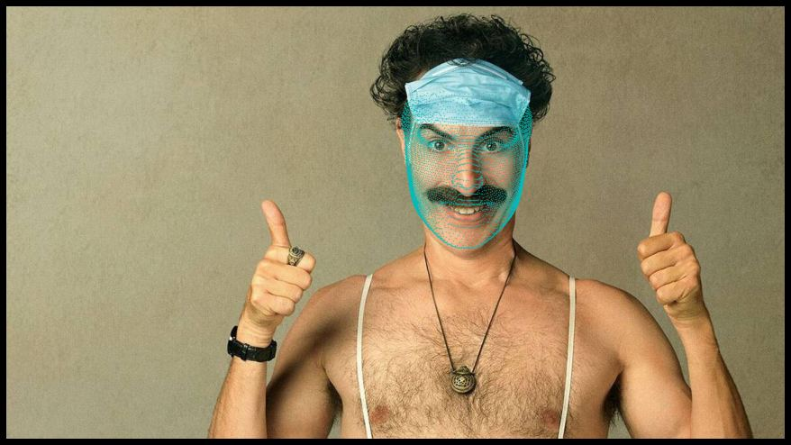
      - Warp the face-mask image to create a texture for the 3D face model;

          |Face texture | Warped face mask texture| Combined render |
          |------|------| ------- |
          |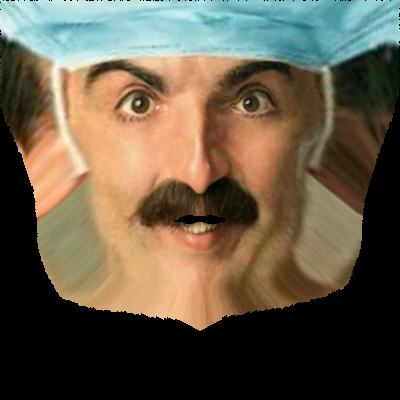 | |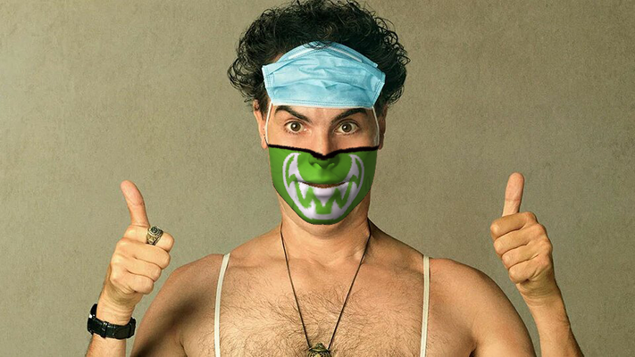 |
      - Generate a separate 3D model for the face mask, which fits the face 3D model;

          |Before| After*|
          |------|------|
          |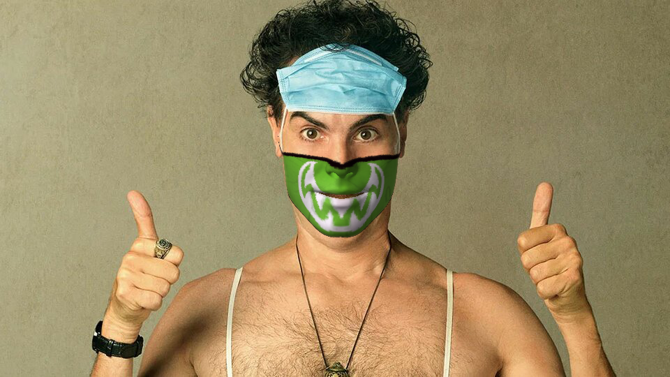 ||

          An example for another input image:

          |Before| After*|
          |------|------|
          |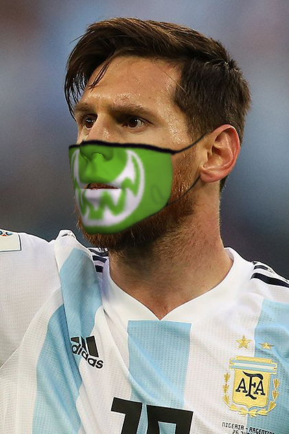 |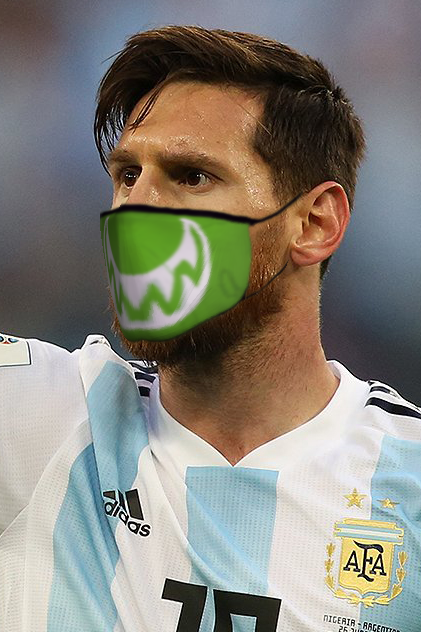|
      - Estimate the lightning position, which is a parameter for rendering of the 3D mask;

          |Before| After*|
          |------|------|
          |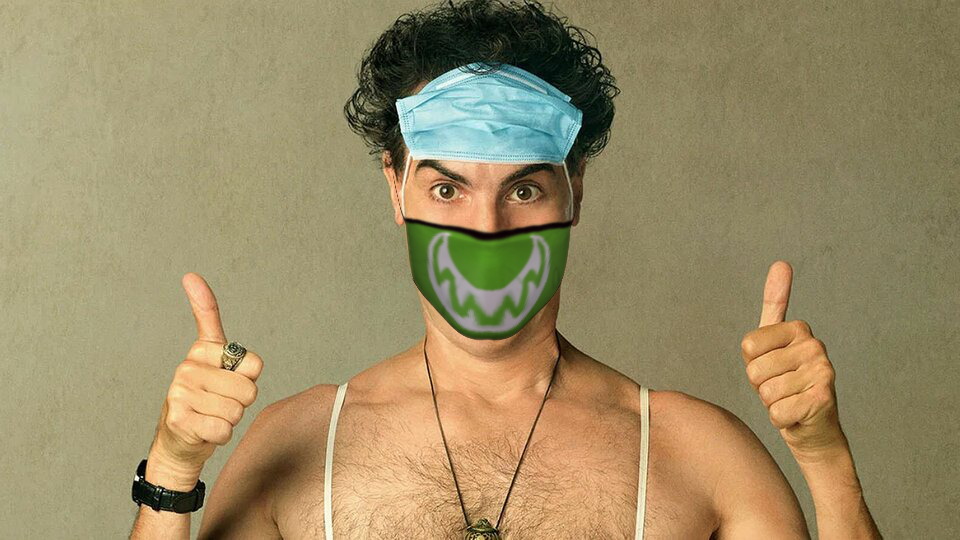 ||
      - Estimate the color temperature of the face image, which is applied to the texture before rendering of the 3D mask;

          |Before| After*|
          |------|------|
          |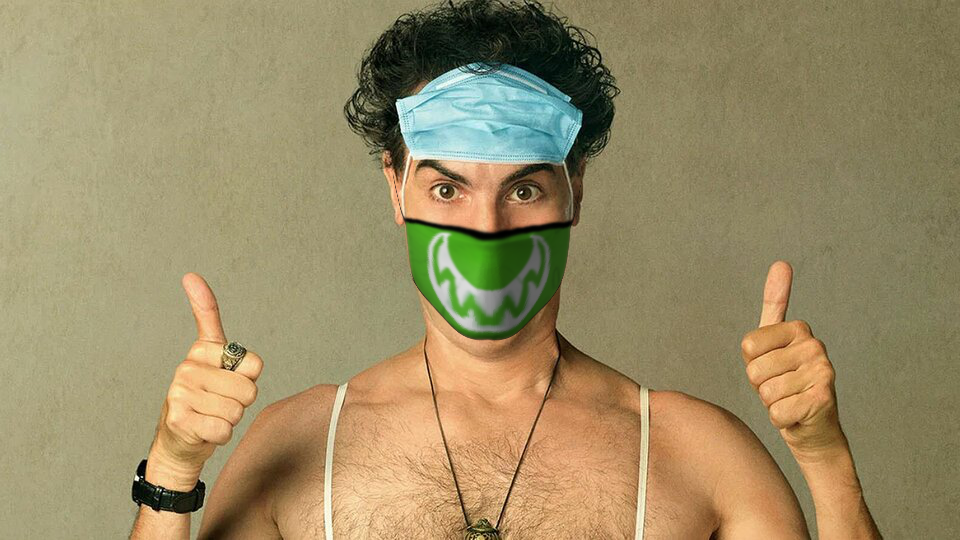 ||
      - Render the 3D face mask onto the image using the renderer provided with the 3DDFA_V2 solution. For better quality at the mask edges, use alpha-blending and light-wrap techniques.

          |Input image| Rendered result|
          |------|------|
          |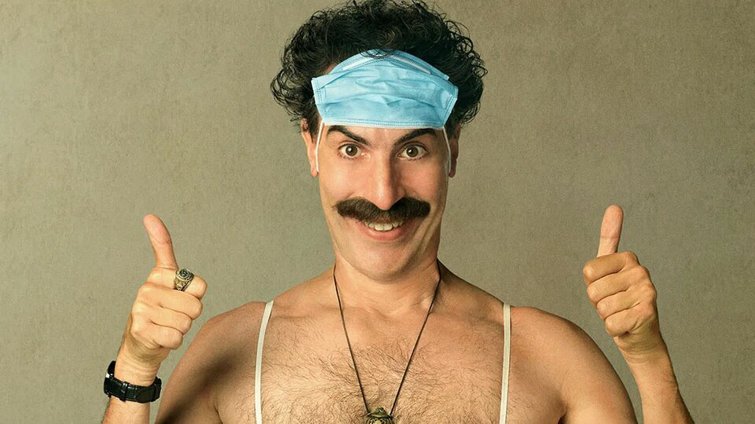 ||

       *-"After" shows the final result after all intermediate steps.

## Evaluation

  1. Find an open-source solution for face re-identification and evaluate it on the LFW ([Labeled Faces in the Wild](http://vis-www.cs.umass.edu/lfw/)) dataset (6 hours).

     **Used solution**: [FaceNet](https://github.com/davidsandberg/facenet) based on [this paper](https://arxiv.org/abs/1503.03832).

  2. Generate a dataset with masks using original LFW (10 hours).

     |Before| After|
     |------|------|
     |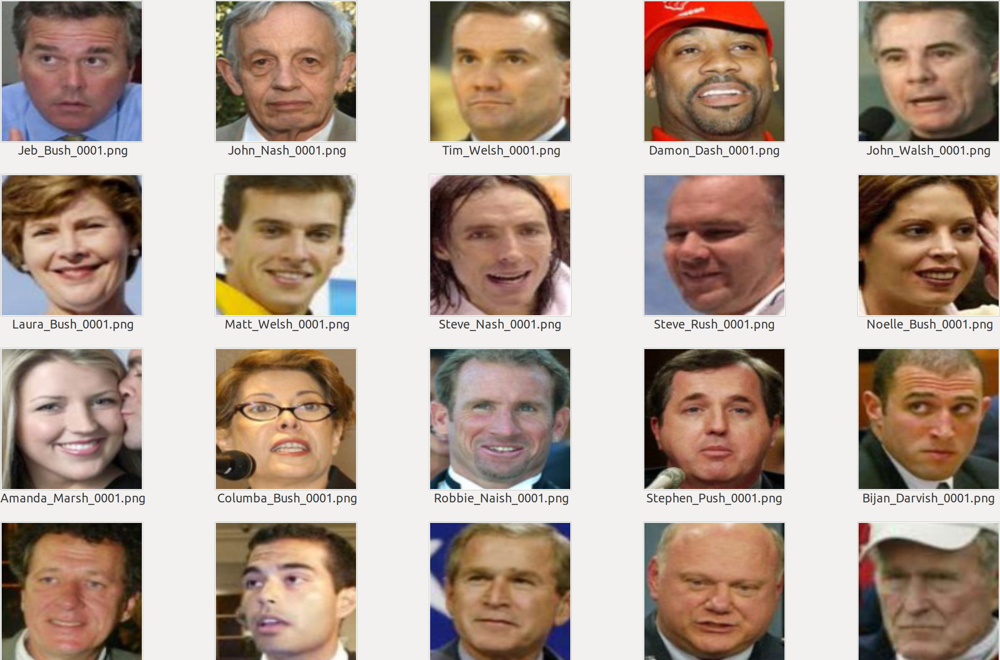 |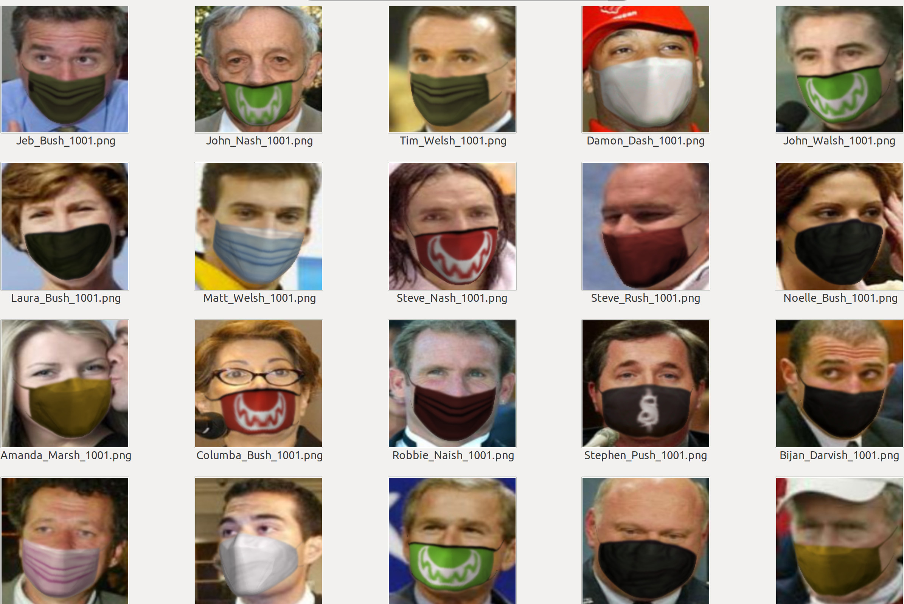|
  3. Evaluate the solution on the generated dataset in 4 different face pair matching configurations:
      * no mask - no mask (original);
      * mask - no mask;
      * no mask - mask;
      * mask - mask.

      The results are [here](validation_results.txt). It is worth to mention that the model has not seen faces in masks during the training, so the performance drop was expected (2 hours).

## Additional time consumption

  1. Code refactoring to speed-up the image processing (6-8 hours).
  2. Creating configurations for model evaluation in 4 different settings (1 hour).
  3. Summary writing (6 hours).

## Mask detection

Additionaly, we considered a problem of detection face masks. More precisely, we trained a binary classisier to check if a person is wearing a mask.

1. Data preprocessing. 
We used original LFW dataset and its copy covered with masks. Overall dataset consits of ~26k images. Since the size of the dataset is not that big, we used data augmentation using [albumentation](https://albumentations.ai/). The example of observed albumentated image is showed below:
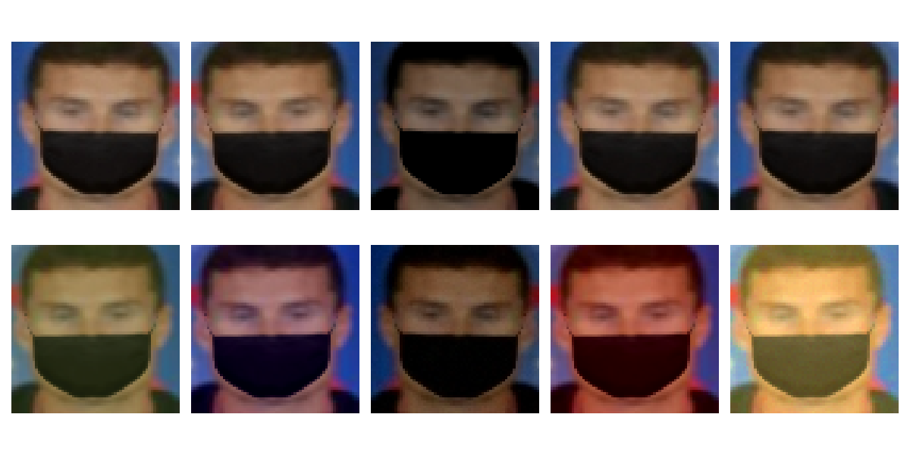

2. Train and test a model.
The baseline model is a ResNet18. It achieves 99.9% accuracy (5292/5294 correctly classified image).
We also tried it on the real images from the Internet and it works well. The only case when it was fooled is when a person wae wearing a transparent mask. But since we do not have them among our masks, it is not suprisingly.

## Instructions for running the demo

The demo firstly detect if a person is wearing a mask. If the mask was not found, it put a random mask on a person.

1. Clone this repository. 
2. Follow the instructions from [demo/readme.md](demo/readme.md).

## Instructions for reproducing re-identification evaluation

  1. Install all required packages from the [requirements.txt](requirements.txt).
  2. Clone [3DDFA_V2](https://github.com/cleardusk/3DDFA_V2) repository and merge it with the `3DDFA_V2` directory of this project.
  
  4. To reproduce dataset generation and the model evaluation - firstly, clone [fecenet](https://github.com/davidsandberg/facenet) repository and merge it with corresponding directory of this project.

     As a result you should have three additional files (`pairs_mask_both.txt`, `pairs_mask_first.txt`, `pairs_mask_second.txt`) in `facenet/data`.
  5. Follow the instructions described [here](https://github.com/davidsandberg/facenet/wiki/Validate-on-lfw) to get the model and evaluate it on the original LFW dataset. For consistency, save the LFW in dataset directory as it described in the instructions.

     Alternatively, you can use the uploaded dataset in `dataset`, which consists of original already preprocessed images and generated images with masks. It is stored as a multi-file zip archive.

     To get the normal zip archive, run the command:

     `zip -F dataset/lfw_mtcnnpy_160.zip --out dataset.zip`

     And then unzip the obtained archive.
  6. Generate the dataset with masks by running `Mask-Generator.ipynb`, or use the already generated as described above.
  7. Run step 6 from [here](https://github.com/davidsandberg/facenet/wiki/Validate-on-lfw) with additional parameter `lfw_pairs="data/pairs_mask_first.txt"` to get the model evaluation on pairs "mask - no mask". You can also set this parameter to be equal either `"pairs_mask_both.txt"`, or `"pairs_mask_second.txt"` to get evaluation on "mask - mask" or "no mask - mask" pairs correspondingly. The results should be similar to the [validation_results.txt](validation_results.txt).

## Instructions for training baseline model
1. Make sure that all packages from the [requirements.txt](requirements.txt) are installed.
2. Check that the dataset is located in '~/datasets/lfw/lfw_mtcnnpy_160'.
3. Run classifier.py to train a model.

## Discussion
We created a solution for covering humans faces with masks and creating a dataset for face re-identification. Comparing to [this](https://doi.org/10.6028/NIST.IR.8311) paper, where authors just covered faces with a solid color, we took into account the 3D face shape, pose, and image lightning, which makes our approach more realistic. Unfortunately, we were not able to compare the performance of the models used in that research, since the models were not publicly available.

We evaluated a model, trained for face re-identification, on the dataset, generated from the test set by adding masks. Surprisingly, the performance was still much better that random, however it decreased significantly. This can be fixed by retraining or fine-tuning the model on the dataset with masks. However, we did not do that because generating the whole train set and further model training would take too much time.

Our main goal was to collect sufficiently large dataset. We created a dataset with 13233 images, which is not a huge number, but the tool we have created allows to produce as many images with masks as there are face images without masks, or even more (by using different masks). Therefore, we claim that the main goal has been successfully achieved.

Overall this part of the project took 70+ hours.

## Appendix: other proposed, but not realized approaches

In [proposal.md](proposal.md) we proposed three other solutions for creating such dataset. In this section, we want to clarify why they have been discarded.

The first two approaches were about collecting data either by making photos of real people, or by searching photos through the Internet. Contacts with real people are not widely allowed now, so due to the safety measures we discarded this approach. Searching through the Internet was also not promising: to collect the data for re-identification we had to look for the same people with and without masks, likely celebrities. Moreover, we would like to have several photos of each kind, which makes searching process harder, since there are no that many different photos of celebrities wearing masks (at least for the football players for which we were looking for).
Another drawback of these methods is that, in contrast to our approach, they require much more time to collect and label a big number of images.

Another promising approach was to use generative models for adding masks on face images. However, such generative models require corresponding train data, which is images with masks in our case. So to perform this approach we firstly have to collect such dataset, which is a little bit irrational in terms of our main goal.
